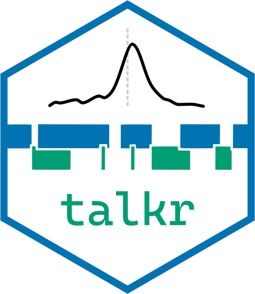

# talkr <a href="https://elpaco-escience.github.io/talkr/"></a>

<!-- badges: start -->
[](https://cran.r-project.org/package=talkr)
[](git@github.com:elpaco-escience/talkr)
[](https://github.com/elpaco-escience/talkr/actions/workflows/R-CMD-check.yaml)  [](https://app.codecov.io/github/elpaco-escience/talkr)
[](https://elpaco-escience.github.io/talkr/)
[](https://lifecycle.r-lib.org/articles/stages.html#maturing)
<!-- badges: end -->

`talkr` offers a set of convenience functions for quality control, visualisation and analysis of conversational data.
It provides support for at least two common needs of people working with conversational corpora:
(1) quality control by offering rapid insights into the nature, timing, and quality of time-aligned annotations in a conversational corpus; and
(2) compelling visualisations by offering a range of plotting functions that play well with ggplot and the tidyverse. 

Note: `talkr` plays well with its companion python package [`scikit-talk`](https://github.com/elpaco-escience/scikit-talk), which is focused more on processing conversational data and readying it for downstream analysis.

## Installation

You can install the development version of `talkr` from GitHub with:

``` r
# install.packages("devtools")
devtools::install_github("elpaco-escience/talkr", build_vignettes = TRUE)
```

`talkr` has been submitted to CRAN, and will soon be installable with:
```r
install.packages("talkr")
```

## Workflows

Two workflows for `talkr` are described in [the workflows vignette](https://elpaco-escience.github.io/talkr/articles/workflows.html).


You can also access the vignette from RStudio, by running:

``` r
vignette("workflows", package = "talkr")
```

## Contact

Questions? Comments? They are more than welcome!
This package is under active development and still has some rough edges.
Interact with us in the [issues](https://github.com/elpaco-escience/talkr/issues) if you have any questions or suggestions.
